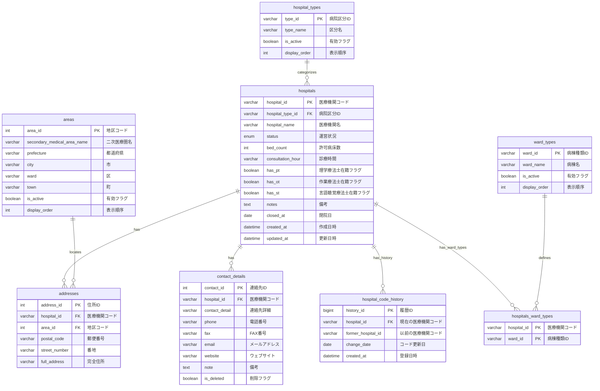

##### 1. 医療機関基本情報系

---

##### 2. 人員・組織情報系

---

##### 3. 診療科・診療内容系

---

##### 4. 連携・ネットワーク系

---

##### 5. 紹介・診療支援系

---

##### 6. システム管理・ユーザー系

##### 7. ログ・監査系

---

##### 8. 問い合わせ・サポート系

---

##### 9. システム運営管理系

---

##### 10. その他管理系

