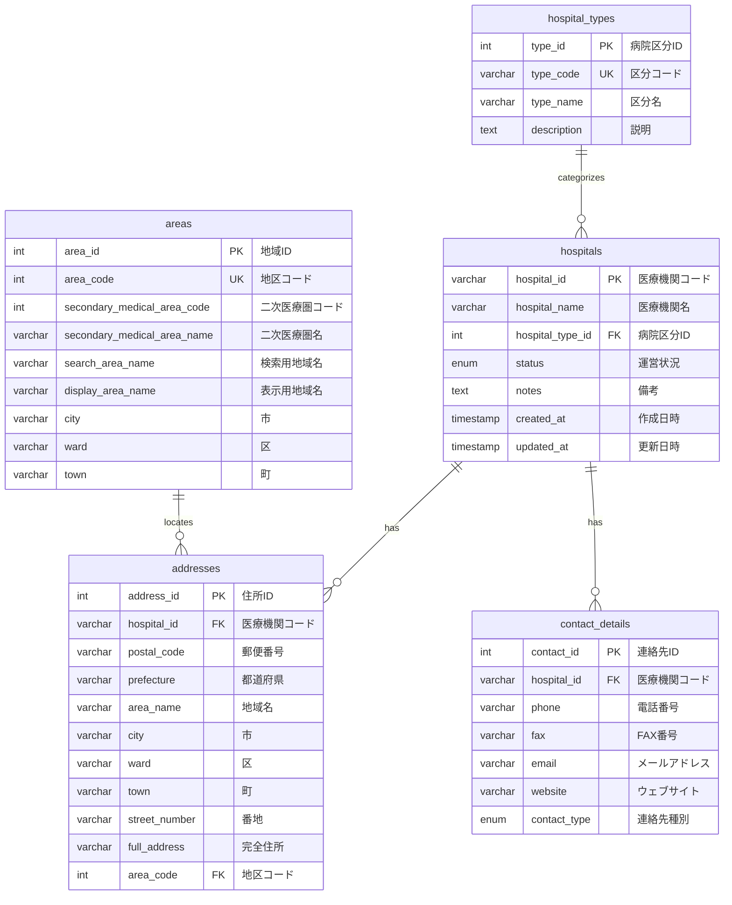
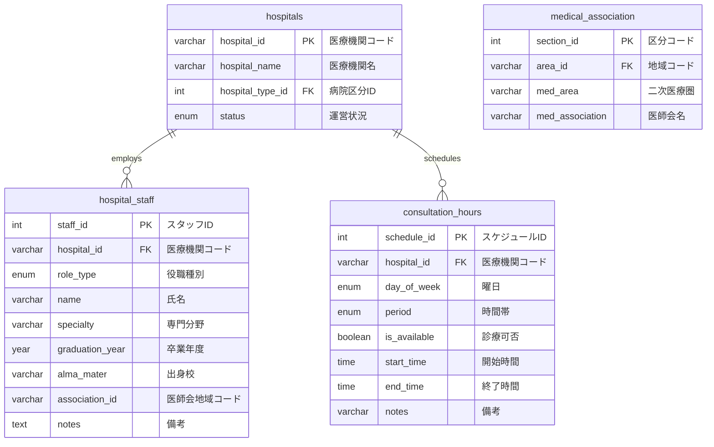
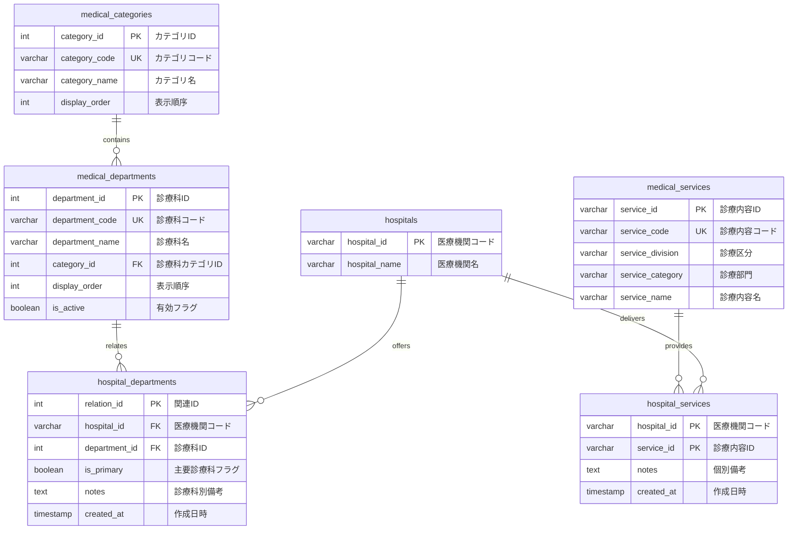
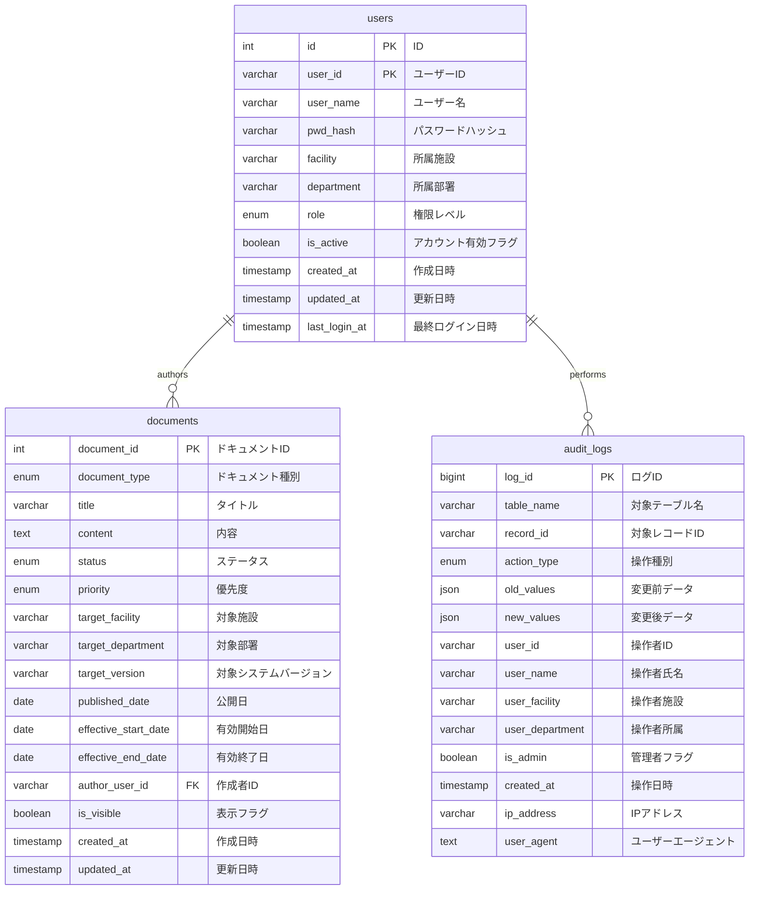
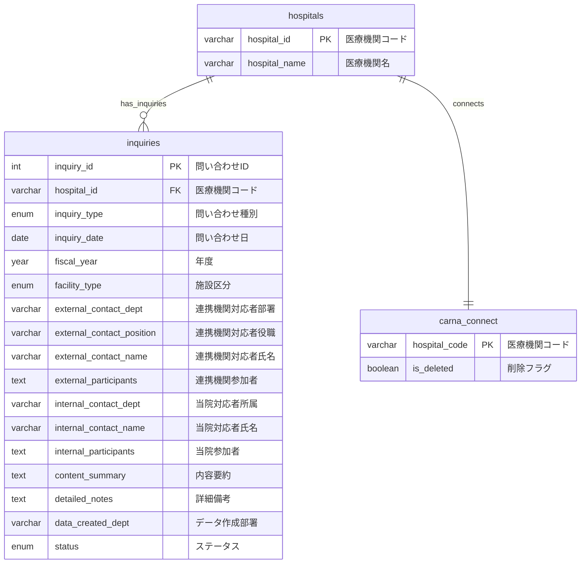
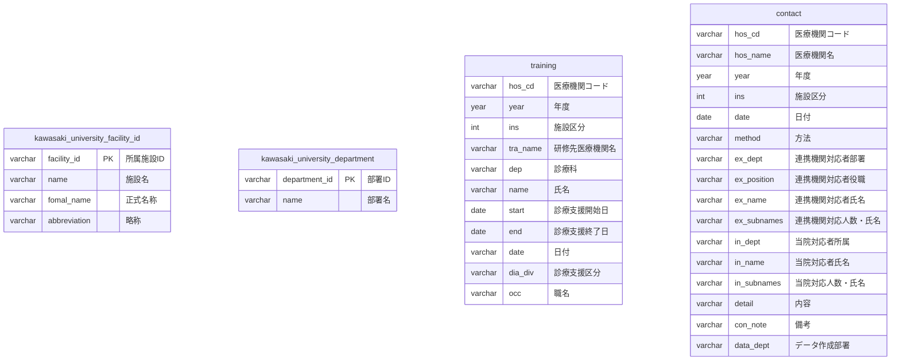

# 病院システム E-R図

> **注意**: 図が小さすぎて見えない場合は、各セクション別の詳細図をご覧ください。

## 全体概要図

```mermaid
erDiagram
    %% 医療機関基本情報系
    hospitals {
        varchar hospital_id PK "医療機関コード"
        varchar hospital_name "医療機関名"
        int hospital_type_id FK "病院区分ID"
        enum status "運営状況"
        text notes "備考"
        timestamp created_at "作成日時"
        timestamp updated_at "更新日時"
    }
    
    hospital_types {
        int type_id PK "病院区分ID"
        varchar type_code UK "区分コード"
        varchar type_name "区分名"
        text description "説明"
    }
    
    addresses {
        int address_id PK "住所ID"
        varchar hospital_id FK "医療機関コード"
        varchar postal_code "郵便番号"
        varchar prefecture "都道府県"
        varchar area_name "地域名"
        varchar city "市"
        varchar ward "区"
        varchar town "町"
        varchar street_number "番地"
        varchar full_address "完全住所"
        int area_code FK "地区コード"
    }
    
    contact_details {
        int contact_id PK "連絡先ID"
        varchar hospital_id FK "医療機関コード"
        varchar phone "電話番号"
        varchar fax "FAX番号"
        varchar email "メールアドレス"
        varchar website "ウェブサイト"
        enum contact_type "連絡先種別"
    }
    
    %% 人員情報系
    hospital_staff {
        int staff_id PK "スタッフID"
        varchar hospital_id FK "医療機関コード"
        enum role_type "役職種別"
        varchar name "氏名"
        varchar specialty "専門分野"
        year graduation_year "卒業年度"
        varchar alma_mater "出身校"
        varchar association_id "医師会地域コード"
        text notes "備考"
    }
    
    medical_association {
        int section_id PK "区分コード"
        varchar area_id FK "地域コード"
        varchar med_area "二次医療圏"
        varchar med_association "医師会名"
    }
    
    %% 診療時間系
    consultation_hours {
        int schedule_id PK "スケジュールID"
        varchar hospital_id FK "医療機関コード"
        enum day_of_week "曜日"
        enum period "時間帯"
        boolean is_available "診療可否"
        time start_time "開始時間"
        time end_time "終了時間"
        varchar notes "備考"
    }
    
    %% 診療科系
    medical_categories {
        int category_id PK "カテゴリID"
        varchar category_code UK "カテゴリコード"
        varchar category_name "カテゴリ名"
        int display_order "表示順序"
    }
    
    medical_departments {
        int department_id PK "診療科ID"
        varchar department_code UK "診療科コード"
        varchar department_name "診療科名"
        int category_id FK "診療科カテゴリID"
        int display_order "表示順序"
        boolean is_active "有効フラグ"
    }
    
    hospital_departments {
        int relation_id PK "関連ID"
        varchar hospital_id FK "医療機関コード"
        int department_id FK "診療科ID"
        boolean is_primary "主要診療科フラグ"
        text notes "診療科別備考"
        timestamp created_at "作成日時"
    }
    
    %% 診療内容系
    medical_services {
        varchar service_id PK "診療内容ID"
        varchar service_code UK "診療内容コード"
        varchar service_division "診療区分"
        varchar service_category "診療部門"
        varchar service_name "診療内容名"
    }
    
    hospital_services {
        varchar hospital_id PK "医療機関コード"
        varchar service_id PK "診療内容ID"
        text notes "個別備考"
        timestamp created_at "作成日時"
    }
    
    %% 地域・エリア系
    areas {
        int area_id PK "地域ID"
        int area_code UK "地区コード"
        int secondary_medical_area_code "二次医療圏コード"
        varchar secondary_medical_area_name "二次医療圏名"
        varchar search_area_name "検索用地域名"
        varchar display_area_name "表示用地域名"
        varchar city "市"
        varchar ward "区"
        varchar town "町"
    }
    
    %% 外部連携系
    carna_connect {
        varchar hospital_code PK "医療機関コード"
        boolean is_deleted "削除フラグ"
    }
    
    %% 問い合わせ・コミュニケーション系
    inquiries {
        int inquiry_id PK "問い合わせID"
        varchar hospital_id FK "医療機関コード"
        enum inquiry_type "問い合わせ種別"
        date inquiry_date "問い合わせ日"
        year fiscal_year "年度"
        enum facility_type "施設区分"
        varchar external_contact_dept "連携機関対応者部署"
        varchar external_contact_position "連携機関対応者役職"
        varchar external_contact_name "連携機関対応者氏名"
        text external_participants "連携機関参加者"
        varchar internal_contact_dept "当院対応者所属"
        varchar internal_contact_name "当院対応者氏名"
        text internal_participants "当院参加者"
        text content_summary "内容要約"
        text detailed_notes "詳細備考"
        varchar data_created_dept "データ作成部署"
        enum status "ステータス"
    }
    
    %% システム管理系
    users {
        int id PK "ID"
        varchar user_id PK "ユーザーID"
        varchar user_name "ユーザー名"
        varchar pwd_hash "パスワードハッシュ"
        varchar facility "所属施設"
        varchar department "所属部署"
        enum role "権限レベル"
        boolean is_active "アカウント有効フラグ"
        timestamp created_at "作成日時"
        timestamp updated_at "更新日時"
        timestamp last_login_at "最終ログイン日時"
    }
    
    kawasaki_university_facility_id {
        varchar facility_id PK "所属施設ID"
        varchar name "施設名"
        varchar fomal_name "正式名称"
        varchar abbreviation "略称"
    }
    
    kawasaki_university_department {
        varchar department_id PK "部署ID"
        varchar name "部署名"
    }
    
    documents {
        int document_id PK "ドキュメントID"
        enum document_type "ドキュメント種別"
        varchar title "タイトル"
        text content "内容"
        enum status "ステータス"
        enum priority "優先度"
        varchar target_facility "対象施設"
        varchar target_department "対象部署"
        varchar target_version "対象システムバージョン"
        date published_date "公開日"
        date effective_start_date "有効開始日"
        date effective_end_date "有効終了日"
        varchar author_user_id FK "作成者ID"
        boolean is_visible "表示フラグ"
        timestamp created_at "作成日時"
        timestamp updated_at "更新日時"
    }
    
    %% 履歴・ログ系
    audit_logs {
        bigint log_id PK "ログID"
        varchar table_name "対象テーブル名"
        varchar record_id "対象レコードID"
        enum action_type "操作種別"
        json old_values "変更前データ"
        json new_values "変更後データ"
        varchar user_id "操作者ID"
        varchar user_name "操作者氏名"
        varchar user_facility "操作者施設"
        varchar user_department "操作者所属"
        boolean is_admin "管理者フラグ"
        timestamp created_at "操作日時"
        varchar ip_address "IPアドレス"
        text user_agent "ユーザーエージェント"
    }
    
    %% その他統合テーブル
    training {
        varchar hos_cd "医療機関コード"
        year year "年度"
        int ins "施設区分"
        varchar tra_name "研修先医療機関名"
        varchar dep "診療科"
        varchar name "氏名"
        date start "診療支援開始日"
        date end "診療支援終了日"
        varchar date "日付"
        varchar dia_div "診療支援区分"
        varchar occ "職名"
    }
    
    contact {
        varchar hos_cd "医療機関コード"
        varchar hos_name "医療機関名"
        year year "年度"
        int ins "施設区分"
        date date "日付"
        varchar method "方法"
        varchar ex_dept "連携機関対応者部署"
        varchar ex_position "連携機関対応者役職"
        varchar ex_name "連携機関対応者氏名"
        varchar ex_subnames "連携機関対応人数・氏名"
        varchar in_dept "当院対応者所属"
        varchar in_name "当院対応者氏名"
        varchar in_subnames "当院対応人数・氏名"
        varchar detail "内容"
        varchar con_note "備考"
        varchar data_dept "データ作成部署"
    }
    
    %% リレーションシップ（外部キー制約）
    hospitals ||--o{ addresses : "has"
    hospitals ||--o{ contact_details : "has"
    hospitals ||--o{ hospital_staff : "has"
    hospitals ||--o{ consultation_hours : "has"
    hospitals ||--o{ hospital_departments : "has"
    hospitals ||--o{ hospital_services : "has"
    hospitals ||--o{ inquiries : "has"
    hospitals ||--|| carna_connect : "connects"
    
    hospital_types ||--o{ hospitals : "categorizes"
    
    areas ||--o{ addresses : "locates"
    areas ||--o{ medical_association : "belongs_to"
    
    medical_categories ||--o{ medical_departments : "contains"
    medical_departments ||--o{ hospital_departments : "relates"
    
    medical_services ||--o{ hospital_services : "provides"
    
    users ||--o{ documents : "authors"
    users ||--o{ audit_logs : "performs"
```

---

## セクション別詳細図

### 1. 医療機関基本情報系

### 2. 人員・組織情報系

### 3. 診療科・診療内容系

### 4. システム管理・監査系

### 5. 問い合わせ・連携管理系

### 6. 川崎学園固有・その他

---

## 主要なリレーションシップ

### 1. 医療機関中心の関係
- **hospitals** が中心テーブルとして、以下のテーブルと1対多の関係
  - addresses（住所情報）
  - contact_details（連絡先情報）
  - hospital_staff（スタッフ情報）
  - consultation_hours（診療時間）
  - hospital_departments（診療科関連）
  - hospital_services（診療内容関連）
  - inquiries（問い合わせ）

### 2. マスタテーブルとの関係
- **hospital_types** → hospitals（病院区分）
- **medical_categories** → medical_departments（診療科カテゴリ）
- **areas** → addresses（地域情報）

### 3. 多対多の関係（中間テーブル）
- **hospital_departments**：hospitals ⟷ medical_departments
- **hospital_services**：hospitals ⟷ medical_services

### 4. システム管理関係
- **users** → documents（ドキュメント作成者）
- **users** → audit_logs（操作者ログ）

### 5. 川崎学園特有の関係
- **kawasaki_university_facility_id**（施設マスタ）
- **kawasaki_university_department**（部署マスタ）

### 6. 履歴・連携情報
- **training**（研修情報）
- **contact**（コンタクト履歴）
- **carna_connect**（外部システム連携）

## 正規化のポイント

1. **第1正規形**：すべてのフィールドが原子値
2. **第2正規形**：部分関数従属の排除（診療科、診療内容のマスタ化）
3. **第3正規形**：推移関数従属の排除（住所、連絡先の分離）

この設計により、データの重複を排除し、整合性を保ちながら拡張性の高いデータベース構造を実現しています。

---

## テーブル詳細定義

### 主要テーブル構造

| テーブル名 | 役割 | 主要フィールド | 関連テーブル |
|-----------|------|----------------|--------------|
| **hospitals** | 医療機関基本情報 | hospital_id(PK), hospital_name, hospital_type_id(FK) | hospital_types, addresses, contact_details |
| **hospital_types** | 病院区分マスタ | type_id(PK), type_code, type_name | hospitals |
| **addresses** | 住所情報 | address_id(PK), hospital_id(FK), full_address | hospitals, areas |
| **contact_details** | 連絡先情報 | contact_id(PK), hospital_id(FK), phone, email | hospitals |
| **medical_departments** | 診療科マスタ | department_id(PK), department_code, department_name | medical_categories, hospital_departments |
| **hospital_departments** | 病院診療科関連 | relation_id(PK), hospital_id(FK), department_id(FK) | hospitals, medical_departments |
| **medical_services** | 診療内容マスタ | service_id(PK), service_code, service_name | hospital_services |
| **hospital_services** | 病院診療内容関連 | hospital_id(PK), service_id(PK) | hospitals, medical_services |
| **users** | システム利用者 | id(PK), user_id, user_name, role | documents, audit_logs |
| **audit_logs** | 監査ログ | log_id(PK), table_name, action_type | users |

### フィールド詳細

#### hospitals（医療機関基本情報）
| フィールド名 | データ型 | 制約 | 説明 |
|-------------|----------|------|------|
| hospital_id | varchar(10) | PRIMARY KEY | 医療機関コード |
| hospital_name | varchar(100) | NOT NULL | 医療機関名 |
| hospital_type_id | int(11) | FOREIGN KEY | 病院区分ID |
| status | enum('active','closed') | DEFAULT 'active' | 運営状況 |
| notes | text | NULL | 備考（基本情報） |
| created_at | timestamp | DEFAULT CURRENT_TIMESTAMP | 作成日時 |
| updated_at | timestamp | ON UPDATE CURRENT_TIMESTAMP | 更新日時 |

#### medical_departments（診療科マスタ）
| フィールド名 | データ型 | 制約 | 説明 |
|-------------|----------|------|------|
| department_id | int(11) | PRIMARY KEY AUTO_INCREMENT | 診療科ID |
| department_code | varchar(10) | UNIQUE NOT NULL | 診療科コード |
| department_name | varchar(100) | NOT NULL | 診療科名 |
| category_id | int(11) | FOREIGN KEY | 診療科カテゴリID |
| display_order | int(11) | DEFAULT 0 | 表示順序 |
| is_active | boolean | DEFAULT true | 有効フラグ |

#### users（システム利用者）
| フィールド名 | データ型 | 制約 | 説明 |
|-------------|----------|------|------|
| id | int(11) | PRIMARY KEY AUTO_INCREMENT | ID |
| user_id | varchar(10) | UNIQUE NOT NULL | ユーザーID |
| user_name | varchar(50) | NOT NULL | ユーザー名 |
| pwd_hash | varchar(255) | NOT NULL | パスワードハッシュ |
| facility | varchar(30) | NULL | 所属施設 |
| department | varchar(30) | NULL | 所属部署 |
| role | enum('admin','editor','viewer') | DEFAULT 'viewer' | 権限レベル |
| is_active | boolean | DEFAULT true | アカウント有効フラグ |

---

## より大きな図を表示する方法

### 方法1: VS Codeでの表示
1. VS Codeでこのファイルを開く
2. `Ctrl+Shift+V` でプレビューモードに切り替え
3. 図の上で右クリック → 「画像を新しいタブで開く」

### 方法2: GitHub/GitLabでの表示
- リポジトリにプッシュすると、より大きなサイズで表示される

### 方法3: Mermaid Live Editorでの表示
1. https://mermaid.live/ にアクセス
2. 上記のMermaidコードをコピー&ペースト
3. 拡大・縮小が自由に可能

### 方法4: draw.ioファイルの利用
既に作成した `hospital_system_ER.drawio` ファイルを使用すると、自由にズームイン・ズームアウトが可能です。

### 方法5: 画像エクスポート
Mermaid Live Editorで図を画像（PNG/SVG）としてエクスポートし、より大きな解像度で保存できます。
